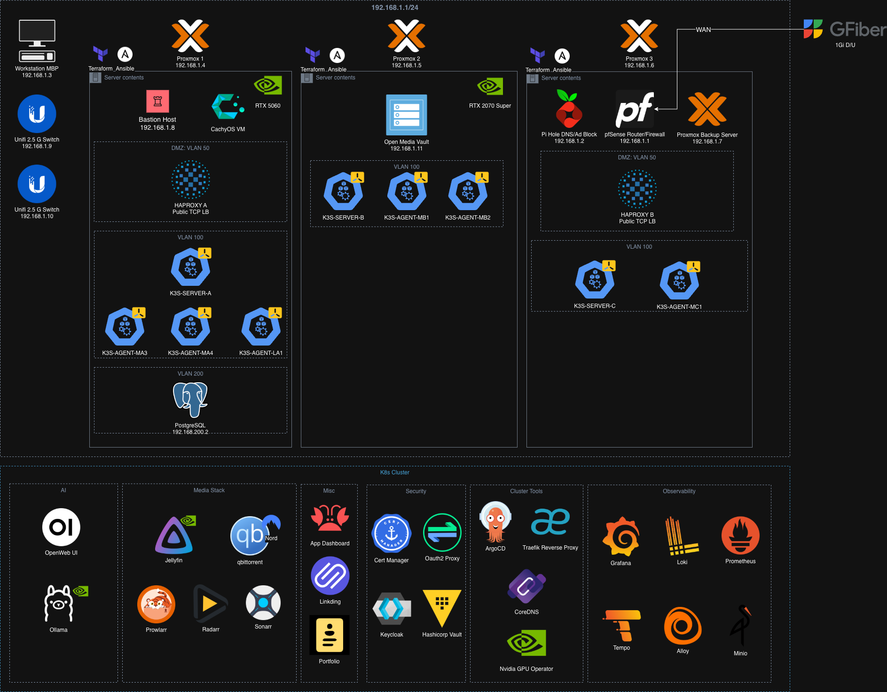

# Home Lab

A fully self-hosted, production-grade home lab running on bare-metal Proxmox nodes. Infrastructure is provisioned as code and services are deployed via GitOps — no manual configuration.



---

## Stack

| Layer | Tools |
|---|---|
| Hypervisor | Proxmox VE (3 nodes) |
| VM Provisioning | Packer + Cloud-Init |
| Infrastructure as Code | Terraform (Proxmox provider) |
| Configuration Management | Ansible |
| Container Orchestration | k3s (Kubernetes) |
| GitOps / CD | ArgoCD |
| Ingress | Traefik |
| Load Balancing | HAProxy (active/passive across nodes) |
| DNS | Pi-hole |
| Secrets Management | HashiCorp Vault + Vault Secrets Operator |
| Identity / SSO | Keycloak + OAuth2 Proxy |
| TLS | cert-manager (Let's Encrypt) |
| Observability | Grafana · Loki · Prometheus · Tempo · Alloy |
| Object Storage | MinIO |
| AI | Ollama + Open WebUI (GPU-accelerated) |
| Media | Jellyfin · Sonarr · Radarr · Prowlarr · qBittorrent-VPN |
| Bookmarks | Linkding |
| Dashboard | Homarr |

---

## How It Works

**Provisioning** — Packer builds golden Ubuntu VM templates on Proxmox. Terraform spins up LXC containers and VMs (k3s servers, agents, databases, HAProxy nodes, Pi-hole) across all three Proxmox nodes using those templates.

**Configuration** — Ansible playbooks bootstrap each node: installs k3s, configures the database, sets up HAProxy with keepalived for HA, and handles VLAN-isolated targets.

**GitOps** — ArgoCD watches this repo. Any manifest change merged to `main` is automatically reconciled into the cluster. A GitHub Actions workflow listens for `repository_dispatch` events from application repos and updates image tags in `values.yaml`, completing the CI→CD loop without manual intervention.

**Security** — All services sit behind Traefik with TLS terminated by cert-manager. SSO is enforced via Keycloak and OAuth2 Proxy. Secrets are stored in Vault and injected into pods by the Vault Secrets Operator — no plaintext secrets in Git.

**Observability** — Alloy scrapes metrics and ships logs cluster-wide. Prometheus stores metrics, Loki stores logs, and Tempo stores traces — all visualized in Grafana. MinIO provides S3-compatible backend storage for Loki and Tempo.

---

## Repository Layout

```
├── packer/            # Golden VM template definitions
├── terraform/         # Proxmox infrastructure (LXC, VMs, k3s cluster)
│   └── modules/       # Reusable LXC and Ubuntu VM modules
├── ansible/           # Node bootstrapping and configuration playbooks
├── k8s_manifests/     # ArgoCD-managed Kubernetes manifests
│   ├── argo-cd/       # ArgoCD self-management
│   ├── cluster-tools/ # Traefik, CoreDNS, NVIDIA GPU Operator
│   ├── security/      # Vault, Keycloak, cert-manager, OAuth2 Proxy
│   ├── observability-stack/  # Grafana, Loki, Prometheus, Tempo, Alloy, MinIO
│   ├── ai/            # Ollama, Open WebUI
│   ├── arr-stack/     # Jellyfin, Sonarr, Radarr, Prowlarr, qBittorrent
│   └── misc/          # Homarr, Linkding, personal portfolio
└── .github/workflows/ # GitOps image-tag automation
```
